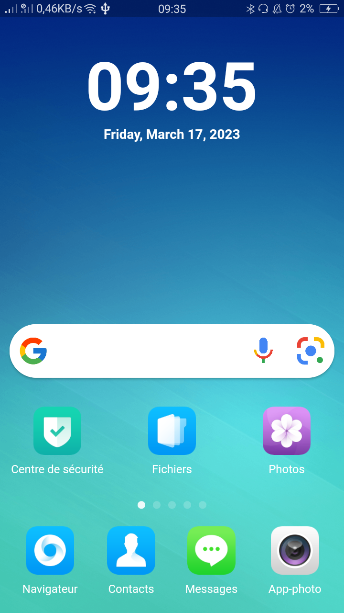
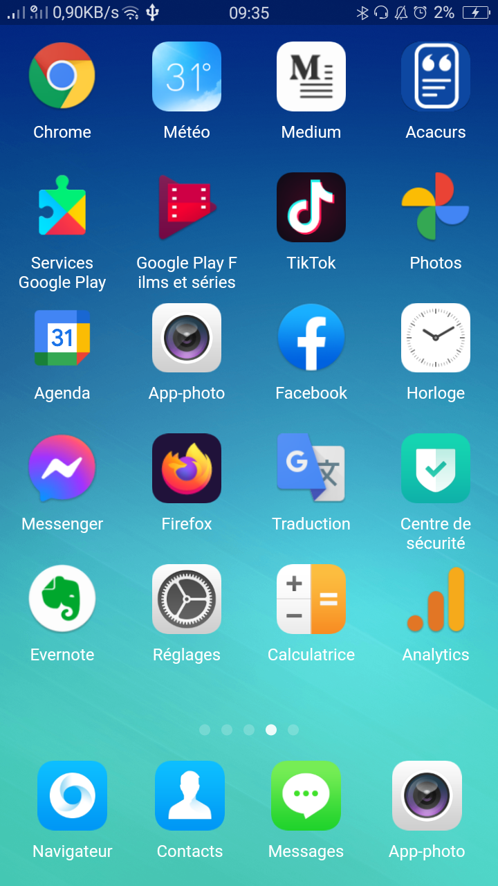
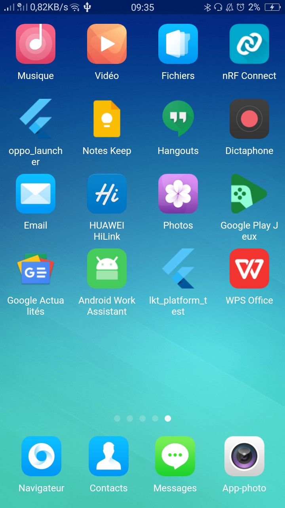

# 🚀 Oppo ColorOS Launcher 🚀

This repository contains the source code for the Oppo ColorOS Launcher built with Flutter and Dart. The launcher is designed to work with Android devices to provide a smooth and personalized user experience.

## 📖 How it Works

The ColorOS Launcher is built using Flutter and Dart, and uses the Android framework. It provides a customized user interface with customizable icons, wallpapers, and themes. This launcher is designed to work with any Android device.

## 💻 System Requirements

The Oppo ColorOS Launcher requires an Android device to function. It is recommended to use the latest version of the Android operating system for the best user experience.

## 🛠️ How to Contribute

We welcome community contributions. To contribute to this project, please follow these steps:

1. Fork this repository
2. Create a branch for your changes
3. Submit a pull request

## 📷 Screenshots

Here are some screenshots of the Oppo ColorOS Launcher in action:

## 📄 License

This project is licensed under the BSD 3-Clause License. Please see the [LICENSE](https://github.com/AbdouAbarchiAboubacar/oppo_color_os_launcher/blob/master/LICENCE) file for more information.

## 📧 Contact

If you have any questions or concerns, please contact the main author of this project at aboubacarabdouabarchidev@gmail.com , +22786165558.
